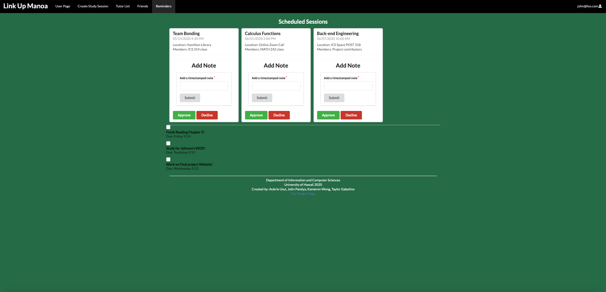

## What is Link-Up-Manoa?

Link-Up-Manoa is platform created for students to create study groups and join study groups that maybe of interest along with connecting with other students that are in their major and taking the same classes. This platform is great for students at UH Manoa because of how large classes sizes are it can be difficult to meet other student and collaborate. Even though we have the ICSpace as a space where students in ICS can meet and collaborate. Link-Up-Manoa takes advantage of the study spaces and allows students to view when and where study groups are in the below image.

## Tutor Page
Additionally students can request tutors to attend these study group sessions on the tutor page. The page is targeted for users based on what classes the users are taking. Tutors are selected by the classes they have taken and the tutors are placed in a ranking based on the ratings users have given. The following image below shows the tutor list.

## Friend Page
For students who are looking to meet other students to collaborate with we created a friends page for students to meet other students. This is helpful as classes at UH Manoa are large which does not really allow students to meet other students who are in the same major and it can connect people together who have similar interests and who are in the same major. Below is an image of the friends page.

## Admin Page
To make sure students are following campus rules on the site we have an admin page. On the admin page the admin has the ability to remove users who are not following the rules on the site. These admins would be advisors and administrators who would be moderating the site. The following image below shows the admin page.

My contribution to this project was working on pages such as the User Profile page, the Admin Page, and the user sign-up page. I mainly worked using the User API I created to manage and create user profiles and help my group members implement API's using the User API I created. The difficulties I faced in this project was going through data in several of the pages and displaying it and additionally adding users to the user database. The following image below is the sign-up page I made to allow for seamless user creation.

