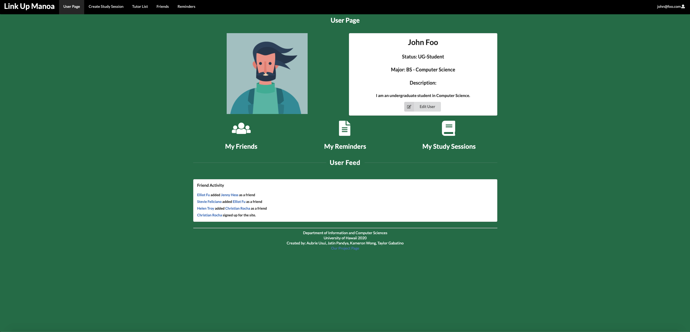

## What is Link-Up-Manoa?

Link-Up-Manoa is platform created for students to create study groups and join study groups that maybe of interest along with connecting with other students that are in their major and taking the same classes. This platform is great for students at UH Manoa because of how large classes sizes are it can be difficult to meet other student and collaborate. Even though we have the ICSpace as a space where students in ICS can meet and collaborate. Link-Up-Manoa takes advantage of the study spaces and allows students to view when and where study groups are in the below image.

Additionally students can request tutors to attend these study group sessions on the tutor page. The page is targeted for users based on what classes the users are taking. Tutors are selected by the classes they have taken and the tutors are placed in a ranking based on the ratings users have given. The following image below shows the tutor list.

