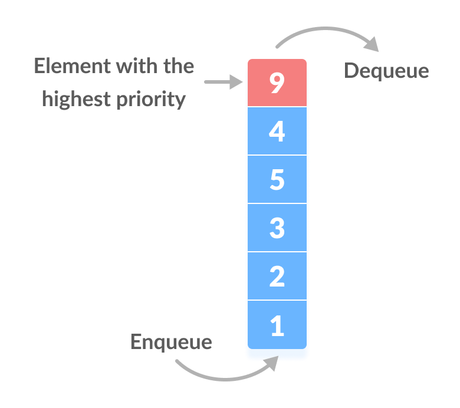

  
  
  

This project implements priority queues, trees, and stack data structures in Java to display Pokemon for a Pokedex and a backpack as in the game of Pokemon GO. The priority queue holds the Pokemons in recent order while the stack holds the Pokemons in numerical order. The pokedex uses a tree to get pokemon from a binary search tree.

To implement the data structures in this project I did projects before that implementing priority queues, trees, and stacks for pokemons as the foundation for this project. I also had to use object oriented principles learned earlier in the semester to be able to create the pokemons. 

In this project for my ICS 211 class I learned how to implement GUI in Java and learned how to connect the all the functions of the software to the buttons and the textareas on the screen. I also learned more about how data structures work along with using multiple options to switch between on the fly.

Source: <a href="https://github.com/jatinp101/Pokemon-Gui"><i class="large github icon "></i>jatinp101/Pokemon-Gui</a>
