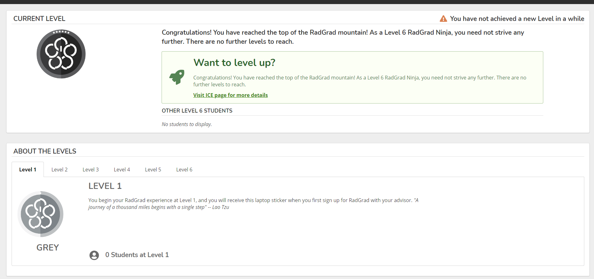

## What is RadGrad? Why have a RadGrad for CENG? 

RadGrad is a platform that improves the experience STEM students have navigating through their degree. The goals of RadGrad are to improve retention in STEM, help students customize their undergrad experience to their interests and goals, and improve student engagement. RadGrad is necessary for Computer Engineering because although there are VIP and X96 Projects and other classes to students to choose from there is not a centralized place for students to navigate their interests and wisely select their X96 and technical electives.  

## How was RadGrad CENG instance created?

RadGrad CENG instance was created with first figuring out what needed to be in the database(Opportunities, Classes, Interests, and Career Goals). I was able to find this information by looking at the ECE department website and compiling information related to CENG and putting it into an Excel Spreadsheet. Next thing I did was transfer it to the documentation with what will be in the database. Finally I ended up creating the instance of RadGrad CENG using a fixture of Computer Engineering that was created a fair bit ago. From there the next thing I did was deploy it to: <a href="radgrad-comp-eng.design">radgrad-comp-eng.design</a> . 

## Challenges 

The challenges in this project were learning a new language (TypeScript), time, and completion of RadGrad2. Learning TypeScript although rather simple at first was a challenge with the slight deviations it makes from JavaScript. For example, while JavaScript does not require you to set data types when working with data. TypeScript requires you to set whether the variable you are working is a number, string, or a class. Time was also a constraint in this project to at least get a working version of RadGrad CENG up to do a Pilot Study of the program in the department. Which also leads to making sure RadGrad 2 had all the pages necessary to get up and running for students to use. 

To overcome the challenge of learning a new language I practiced and I spent time working with TypeScript to get used to TypeScript. Additionally my advisor Dr. Philip Johnson held code reviews which required me to look at code in detail and understand the code and what could be improved. To work with the challenge of time I was set with a schedule of 4 hours/week and I met with my advisor each week to discuss my progress. To also make sure CENG version of RadGrad2 would be complete I also helped out on the Levels page to make progress on the site.

##Conclusion

In this project I created an instance of RadGrad for the Computer Engineering major. While working on this project I gained professional experience with working in a team of Software Engineers. I was able to develop an instance of the software RadGrad and have it reflect the needs of the Computer Engineering degree at UH Manoa. In the future a pilot study can be done to look at the effectiveness of RadGrad on Computer Engineering majors here at UH. I thank my advisor Dr. Philip Johnson for resources and support throughout the project. 

