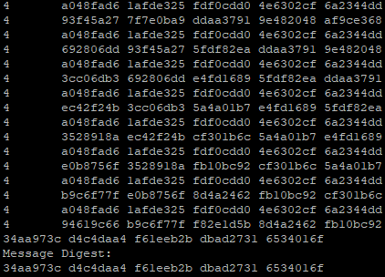

SHA-1 is an algorithm developed by the National Security Agency which takes in data and outputs a 160 bit message digest. SHA-1 was cracked in Febuary of 2017 by Google. The algorithm was used in web protocols such as TLS and SSL. 

For this project I recieved a document and had to read it and understand how the algorithm works, create the pseudocode and programmed it in C. In this project I learned a lot about how binary works and how C works with bit shifting. Additionally with this project about cybersecurity it taught me about how hashing works on the binary level and how encryption algorithms work. 

Overall in this project I learned more about an encryption algorithm which was commonly used and I was able to gain more knowledge about cryptography. Additionally I also learned about reading technical documents and being able to deconstruct them into pseudocode and then finally to code. 

Source: <a href="https://github.com/jatinp101/SHA-1-Implementation-in-C"><i class="large github icon "></i>jatinp101/SHA-1-Implementation-in-C</a>
