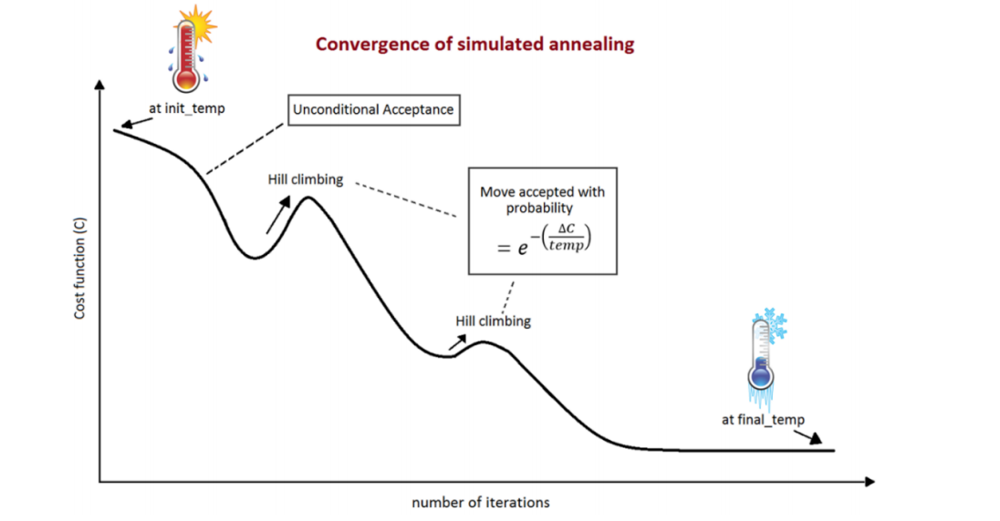

The purpose of this group project was to create a piece of software which could create timetables for classroom. The algorithms used in this program are the Monte Carlo and the Simulated Annealing algorithms. The Monte Carlo algorithm is an algorithm which creates random outputs and has a variance of mostly being correct with a few wrong outputs. The simulated annealing algorithm being a probabilistic algorithm which uses the physics topic of Annealing and applies it in this case the classes being the atoms.  We picked those algorithms because of how well it worked with the problem along with the research we did. 

In this project I was responsible for the programming of the Monte Carlo algorithm and parts of the driver method and the research of the algorithms. Additionally with this project we went to present at the Student Undergraduate Research Fair(SURF) in Fall 2019 at Kapiolani Community College. The next steps after completing this project is to parallelize the program so it can be more efficient along with creating a user interface.

In this research experience I gained experience in reading and creating academic papers and presenting academic materials to an audience. I also gained experience in my skills by also learning more on how to program algorithms, how to work with other data structures like vectors, and being able to tell if the solution is correct or not. 

Source: <a href="https://github.com/jatinp101/ClassTimeTableScheduling"><i class="large github icon "></i>jatinp101/ClassTimeTableScheduling</a>
